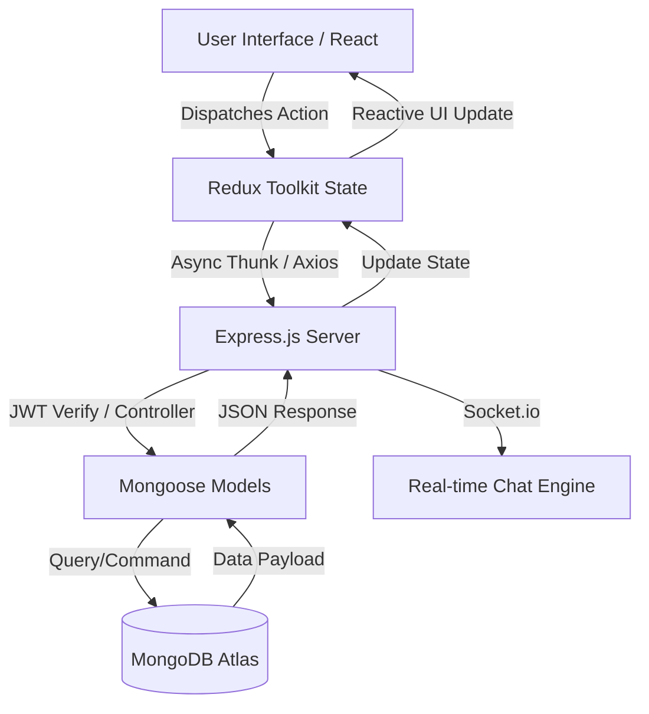

# 🏡 Smart Rent System

<div align="center">
  

  **Revolutionizing the rental experience through technology and community**

  
  
  
  

  [🚀 Live Demo](https://smartrentsystem.netlify.app/) • [📖 Documentation](#) • [🐛 Report Bug](https://github.com/hitesh-kumar123/Smart-Rent/issues) • [✨ Request Feature](https://github.com/hitesh-kumar123/Smart-Rent/issues)
</div>

---

## 📺 Project Demo
<div align="center">
  
  <p><i>Visualizing a seamless property search and booking experience.</i></p>
</div>

---

## 📋 Table of Contents
<details open>
<summary>Click to expand</summary>

- [🎯 Vision](#-vision)
- [🏗️ System Architecture](#️-system-architecture)
- [🛠️ Technology Stack](#️-technology-stack)
- [🔌 API Documentation](#-api-documentation)
- [🚀 Quick Start](#-quick-start)
- [📚 Project Structure](#-project-structure)
- [🔧 Troubleshooting](#-troubleshooting)
- [🤝 Contributing](#-contributing)
- [📄 License](#-license)

</details>

---

## 🎯 Vision
Smart Rent System is a movement towards smarter, more transparent property transactions. As a featured project in **Social Winter of Code (SWoC) 2026**, we aim to provide a high-performance MERN platform for hosts and travelers.

---

## 🏗️ System Architecture
The following diagram illustrates the data flow from the client-side interaction to the persistent database storage.



---

### 🔌 API Documentation

For quick reference, here are the core endpoints of the Smart Rent API. You can use these to integrate with the frontend or test via Postman.

| Endpoint | Method | Description | Auth Required |
| :--- | :---: | :--- | :---: |
| `/api/auth/register` | `POST` | Create a new user account | ❌ |
| `/api/auth/login` | `POST` | Authenticate user & return JWT | ❌ |
| `/api/listings` | `GET` | Retrieve all property listings | ❌ |
| `/api/listings/:id` | `GET` | Get detailed info for a specific listing | ❌ |
| `/api/listings/create`| `POST` | Post a new rental property | ✅ |
| `/api/bookings` | `POST` | Reserve a property for specific dates | ✅ |
| `/api/chat/:userId` | `GET` | Fetch conversation history | ✅ |

> [!TIP]
> **Authentication:** For all protected routes (marked with ✅), ensure you include the JWT token in the `Authorization` header as follows:  
> `Authorization: Bearer <your_jwt_token>`

---

## 🛠️ Technology Stack

The Smart Rent System is built using the **MERN Stack** (MongoDB, Express, React, Node) along with modern tools for real-time communication and cloud storage.

<div align="center">

| Frontend | Backend | DevOps & Tools |
| :--- | :--- | :--- |
| **React 18** & Redux Toolkit | **Node.js** & Express.js | **Docker** & Docker Compose |
| **Tailwind CSS** & Framer Motion | **MongoDB** & Mongoose | **Git** & GitHub Actions |
| **Leaflet.js** (Maps) | **Socket.io** (Real-time) | **Postman** (API Testing) |
| **Axios** (API Calls) | **JSON Web Tokens** (JWT) | **ESLint** & Prettier |
| **React Hook Form** | **Cloudinary** (Media SDK) | **Vite** (Build Tool) |

</div>

---

## 🚀 Quick Start

Follow these steps to get the **Smart Rent System** running on your local machine.

### ✅ Prerequisites Check-list
Before you begin, ensure you have the following installed and set up:
- [ ] **Node.js**: `v18.x` or higher
- [ ] **MongoDB**: Local instance or a [MongoDB Atlas](https://www.mongodb.com/atlas) URI
- [ ] **Cloudinary**: A free account for image hosting ([Sign up here](https://cloudinary.com/))
- [ ] **Docker**: (Optional) Required only if you prefer containerized setup

### 🛠️ Manual Installation

**1. Clone & Install Dependencies**
```
# Clone the repository
git clone [https://github.com/hitesh-kumar123/Smart-Rent-System.git](https://github.com/hitesh-kumar123/Smart-Rent-System.git)

# Enter the project directory
cd Smart-Rent-System

# Install Backend dependencies
cd backend && npm install

# Install Frontend dependencies
cd ../frontend && npm install
```

**2. Setup Environment Variables**
The application requires specific configuration keys to connect to the database, handle authentication, and store images. 

**Steps:**
1. Navigate to the `backend/` directory and create a file named `.env`.
2. Navigate to the `frontend/` directory and create a file named `.env`.
3. Fill in the keys as shown below (refer to the [Configuration](#-configuration) section for more details).

 * **📂 Backend `.env`**
```env
PORT=8000
MONGODB_URI=your_mongodb_uri
JWT_SECRET=your_secret_key
CLOUDINARY_CLOUD_NAME=your_name
CLOUDINARY_API_KEY=your_key
CLOUDINARY_API_SECRET=your_secret
```
* **📂 Frontend `.env`**
```env
VITE_API_BASE_URL=http://localhost:8000/api
VITE_CLOUDINARY_UPLOAD_PRESET=your_preset
```

> [!WARNING] Never commit your .env files to GitHub. They are already included in the .gitignore to keep your credentials safe.

**3. Run the Application** 
Open two terminals to run the services simultaneously:
* **Terminal 1 (Backend):**
```
cd backend
npm run server
```
* **Terminal 2 (Frontend):**
```
cd frontend
npm run dev
```

---

## 📚 Project Structure

The project is organized into a clear separation of concerns between the client and the server, following the **MERN** architecture.

```text
Smart-Rent/
├── backend/
│   ├── controllers/    # Request handlers & business logic
│   ├── models/         # Mongoose schemas & DB logic
│   ├── routes/         # API endpoint definitions
│   ├── middleware/     # Auth, validation & error handlers
│   └── utils/          # Shared helper functions
├── frontend/
│   ├── src/
│   │   ├── redux/      # Global state (Slices & Store)
│   │   ├── components/ # Reusable UI components
│   │   ├── pages/      # Route-based view components
│   │   ├── services/   # API call definitions (Axios)
│   │   └── hooks/      # Custom React hooks
└── docker-compose.yml  # Orchestration for containerized services
```

---

## 🔧 Troubleshooting

If you encounter any issues during setup or development, please check these common solutions before opening a new issue.

* **💻 MongoDB Connection Error**
  * Ensure your local MongoDB service is running (`mongod`).
  * If using **MongoDB Atlas**, check that your current IP address is whitelisted in the **Network Access** tab.
  * Verify that your `MONGODB_URI` in the `.env` file is wrapped in quotes if it contains special characters.

* **🔑 JWT Unauthorized (401/403)**
  * Double-check that the `JWT_SECRET` in your backend `.env` is identical to the one used for token generation.
  * Ensure the frontend is sending the token in the headers as: `Authorization: Bearer <token>`.

* **☁️ Cloudinary Upload Fails**
  * Verify your `CLOUDINARY_CLOUD_NAME`, `API_KEY`, and `API_SECRET` from the Cloudinary Dashboard.
  * Ensure your upload preset is set to 'unsigned' if you are performing client-side uploads.

* **🐳 Docker Port Conflict**
  * If ports `3000` or `8000` are already in use, run `docker compose down` to stop existing containers.
  * Use `lsof -i :8000` (Mac/Linux) or `netstat -ano | findstr :8000` (Windows) to find and kill processes occupying the ports.

> [!TIP]
> Still stuck? Feel free to [open an issue](https://github.com/hitesh-kumar123/Smart-Rent-System/issues) with the "bug" label and include your error logs!

---

## 🤝 Contributing

We ❤️ contributions! **Smart-Rent System** is an open-source project built for **Social Winter of Code (SWoC) 2026**. Whether you're fixing a bug, improving documentation, or adding a new feature, your help is welcome.

### 🛣️ Development Workflow

To ensure a smooth contribution process, please follow these steps:

1.  **Fork the Repo**: Click the 'Fork' button at the top right of this page.
2.  **Clone your Fork**: 
    ```bash
    git clone [https://github.com/hitesh-kumar123/Smart-Rent-System.git](https://github.com/hitesh-kumar123/Smart-Rent-System.git)
    ```
3.  **Create a Branch**: 
    ```bash
    git checkout -b feature/your-feature-name
    ```
4.  **Commit Changes**: Use clear, descriptive commit messages.
    ```bash
    git commit -m 'feat: add amazing new feature'
    ```
5.  **Push to GitHub**:
    ```bash
    git push origin feature/your-feature-name
    ```
6.  **Open a Pull Request**: Go to the original repository and click "New Pull Request".

### 📄 License

This project is licensed under the **MIT License**. This means you are free to use, modify, and distribute the software, provided that the original copyright notice and permission notice are included.

---

<div align="center">

### 🌟 Show your support

If you find this project helpful, please consider giving it a star! It helps the project grow and motivates our contributors.

<a href="https://github.com/hitesh-kumar123/Smart-Rent-System/stargazers">
  
</a>

<p><b>Made with ❤️ by the Smart Rent System Community</b></p>

<br />

[⬆ Back to Top](#-smart-rent-system)

</div>

---
